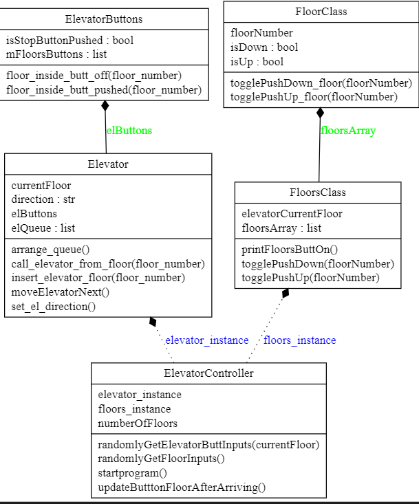

# Elevator Controller written in python:

need to add: 
______________

* ~~floor functionality~~
* elevator controller 
* thinking of thread in program
* elevator skipping if press  up but elvator pass on floor while down
* make stop button on next elevator floor 
* ..........

hardware functions:

* randomlyGetFloorInputs() - in class ElevatorController - get floor button push up/down
* randomlyGetElevatorButtInputs - in class ElevatorController -  get elevator button push [1,2,3,4, stop]

