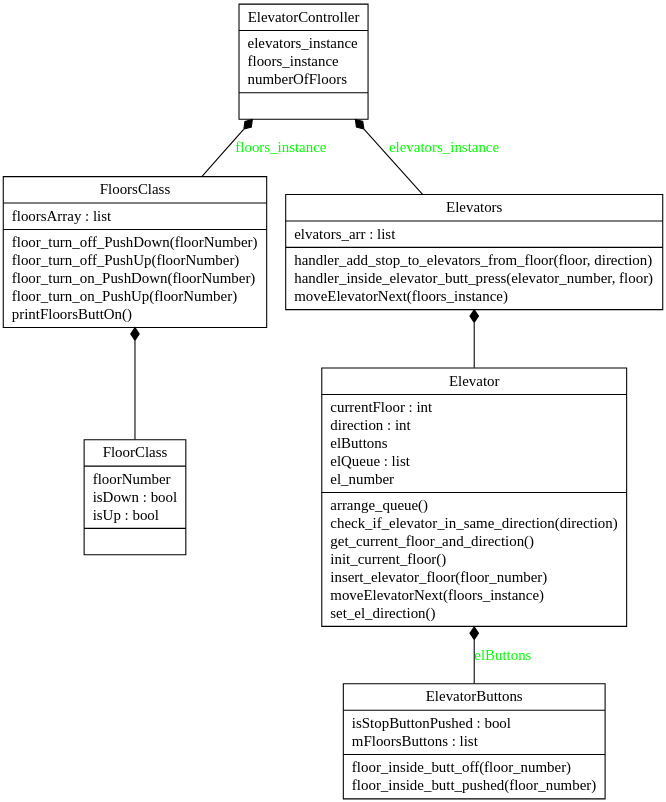

# Elevator Controller written in python:

**system that managing N number of elevators.**

run server ( Scroll down), server will manage all Elevators


send command using client ( Scroll down), client will pass commands from users


### need to add: 
________________

* ~~floor functionality~~
* make code prettier
* better use of threads
* more comments
* ..........





### python logging
https://realpython.com/python-logging/


### server socket
------------------
~~python3 sockets/server_socket.py~~
```python
python3 start_program.py 
```
### client socket
------------------
prompt> s - shutdown  
```python
python3 sockets/client_skeleton.py  s
```

press on floor  
prompt> <floor_up>/<floor_down:command string>     <floor_number:number>  
```python
python3 sockets/client_skeleton.py  floor_up 5
```
press from inside of elevator  
prompt> <el_button_press:command string>  <elevator_number>   <button_number>   
```python
python3  sockets/client_skeleton.py  el_button_press 5  4 
```

### command for UML
--------------------


```bash
pyreverse start_program.py elevatorClass.py floorsClass.py  sockets/client_skeleton.py sockets server_socket.py 
```


info    
https://www.bogotobogo.com/python/Multithread/python_multithreading_Synchronization_Lock_Objects_Acquire_Release.php